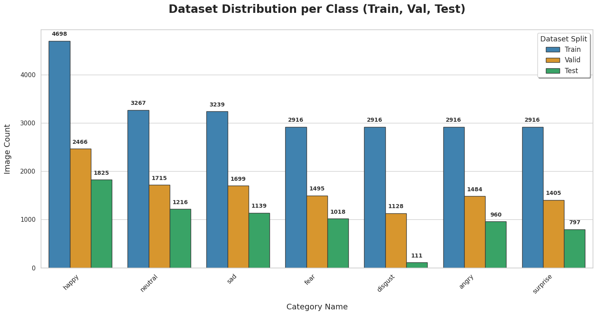
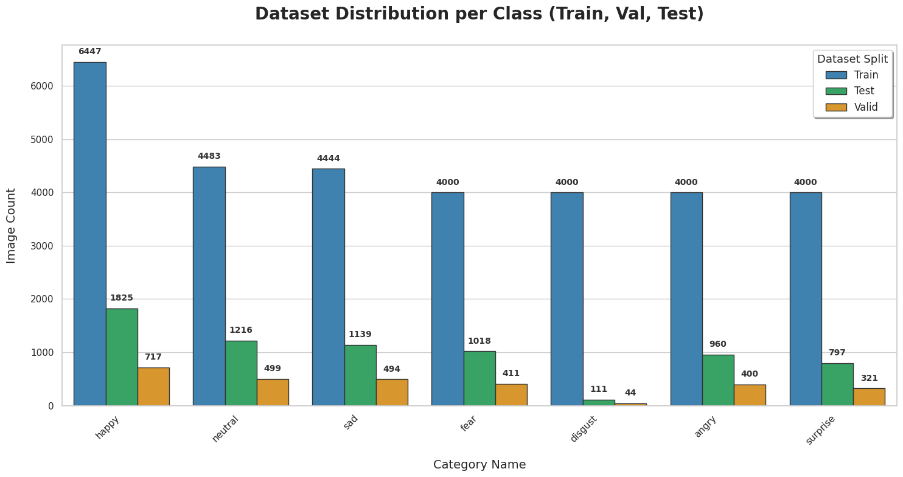

# Human Emotion Detection with LightCBAMNet: A Tiny Deep Learning Model for Edge Devices

---

## 👥 Team 
* T.Sajeeth ([e17144@eng.pdn.ac.lk](mailto:tsajeeth.appsc.sab.ac.lk))
## Supervisors
* Lec. Nishankar.S ([Nishankar@eng.pdn.ac.lk](mailto:Nishankar@eng.pdn.ac.lk))
* Prof. Vigneshwaran.P ([Vigneshwaran@eng.pdn.ac.lk](mailto:Vigneshwaran@eng.pdn.ac.lk))

---

## 📑 Table of Contents
1. [Abstract & Overview](#1-abstract--overview)
2. [Key Innovations](#2-key-innovations)
3. [Data Preparation & Augmentation](#3-data-preparation--augmentation)
4. [Architecture Breakdown](#4-architecture-breakdown)
5. [Setup & Implementation](#5-setup--implementation)
6. [Comparative Analysis](#6-comparative-analysis)
7. [Links](#7-links)

---

## 1. Abstract & Overview
**LightCBAMNet** is a lightweight, high-performance convolutional neural network designed specifically for Facial Emotion Recognition (FER) in resource-constrained environments. By combining efficient depthwise convolutions with a specialized attention mechanism, this model achieves a balance between low parameter counts and high classification accuracy.

🔬 **Research Focus:** This research addresses the challenge of deploying robust Emotion Detection on small edge devices such as IoT sensors, mobile devices, and micro-controllers, ensuring privacy and low latency through local inference.

---

## 2. Key Innovations
* **Phish Activation:** Uses the $x \cdot \tanh(\text{GELU}(x))$ activation function for smoother gradient flow compared to standard ReLU.
* **DCWP Module:** Implements Depthwise Convolution with Phish activation to minimize FLOPs (Floating Point Operations) while maintaining feature richness.
* **CBAM Integration:** A Convolutional Block Attention Module that sequentially applies Channel and Spatial attention, allowing the model to focus on critical facial landmarks like the eyes, nose, and mouth.
* **Efficiency:** Optimized for a tiny memory footprint, making it ideal for real-time inference on hardware without dedicated GPUs.

---

## 3. Data Preparation & Augmentation

### 3.1 Emotion Sample Visualization
The dataset consists of grayscale and RGB facial images categorized into seven distinct emotions. 

*Figure 1: Representative samples from the emotion dataset showing various facial expressions.*

### 3.2 Raw Dataset Distribution
Before processing, a statistical analysis of the dataset was conducted to identify class imbalances.

*Figure 2: Distribution of image counts across the seven emotion categories prior to augmentation.*

### 3.3 Post-Augmentation Analysis
To enhance the robustness of LightCBAMNet, data augmentation techniques (rotations, flips, brightness) were applied to balance the classes.

*Figure 4: Comparison of dataset density and diversity following the application of augmentation pipelines.*

---

## 4. Architecture Breakdown
The model follows a streamlined, modular pipeline:

1.  **Stem:** A large-kernel (7x7) convolution with stride 3 for rapid spatial downsampling.
2.  **DCWP Layers:** Two stages of depthwise-pointwise convolutions for efficient feature extraction.
3.  **LR Modules:** Linear Bottleneck Residual modules to refine features and prevent vanishing gradients.
4.  **Attention Head:** The **CBAM** block (Channel Attention followed by Spatial Attention) to weight important features.
5.  **Classifier:** Global Average Pooling followed by Dropout and a Linear layer for final emotion classification.

---

## 5. Setup & Implementation
**Prerequisites**
* Python 3.8+, PyTorch 1.7+, Torchvision, Scikit-learn, and Tqdm.

**Installation**
* `pip install torch torchvision scikit-learn tqdm`

**Training**
* To train the model on your dataset, use the following command:

  `python train.py --data_dir images --epochs 20 --batch_size 32 --lr 0.001`

---

## 6. Comparative Analysis

| Model | Params | Target Device |
| :--- | :--- | :--- |
| ResNet-50 | ~25.6M | Desktop/Server |
| MobileNetV2 | ~3.4M | Smartphone |
| **LightCBAMNet** | **< 1M** | **Edge/IoT** |

---

## 7. Links
* [Project Repository](https://github.com/Nishan-Charlie/TinyML_Emotional_Detection.git)
* [Project Page](http://127.0.0.1:5500/docs/index.html#analysis)
* [Department of Computing and Information System](#)
* [University of Sabaragamuwa, Sri Lanka](#)

---
© 2026 Department of Computing and Information System, University of Sabaragamuwa