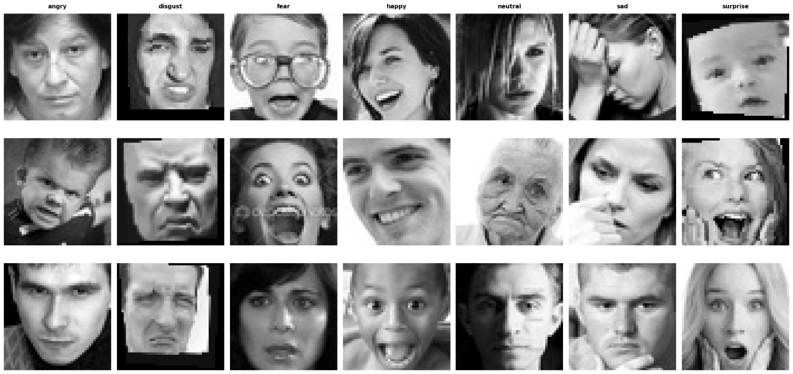
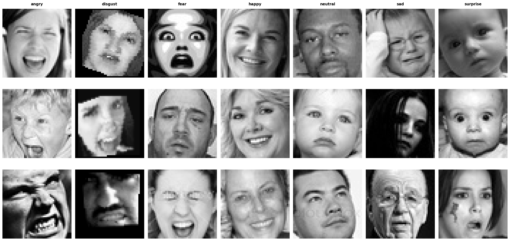
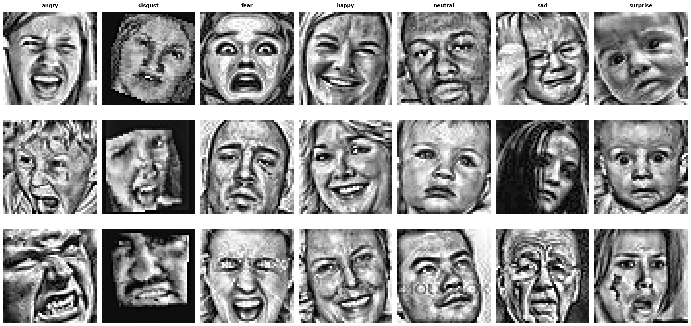
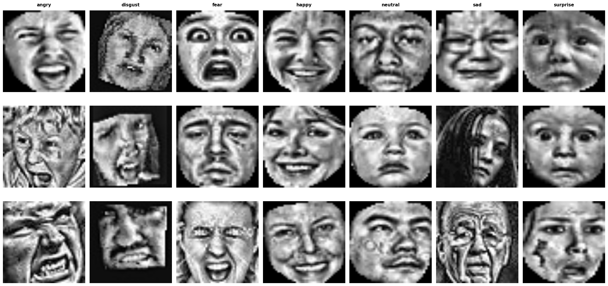
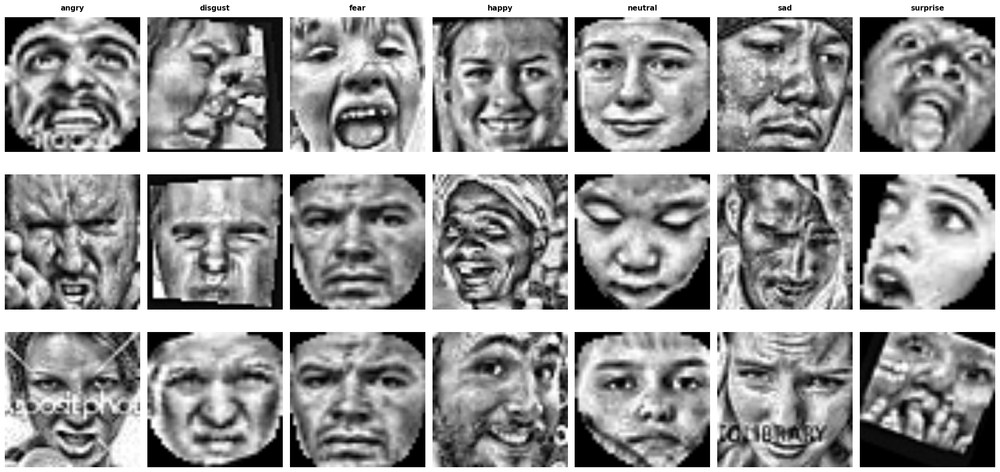
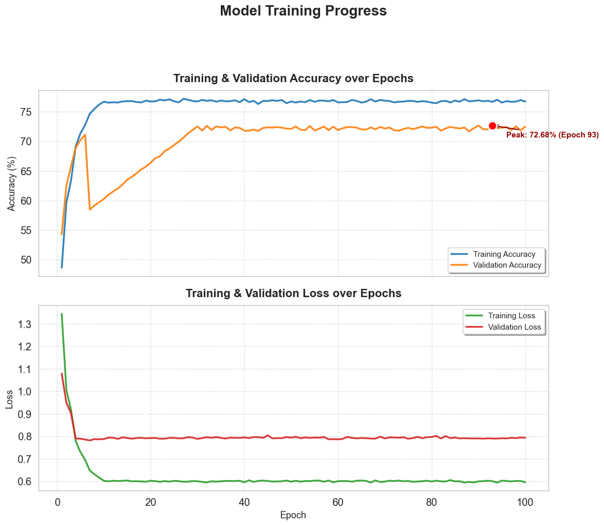
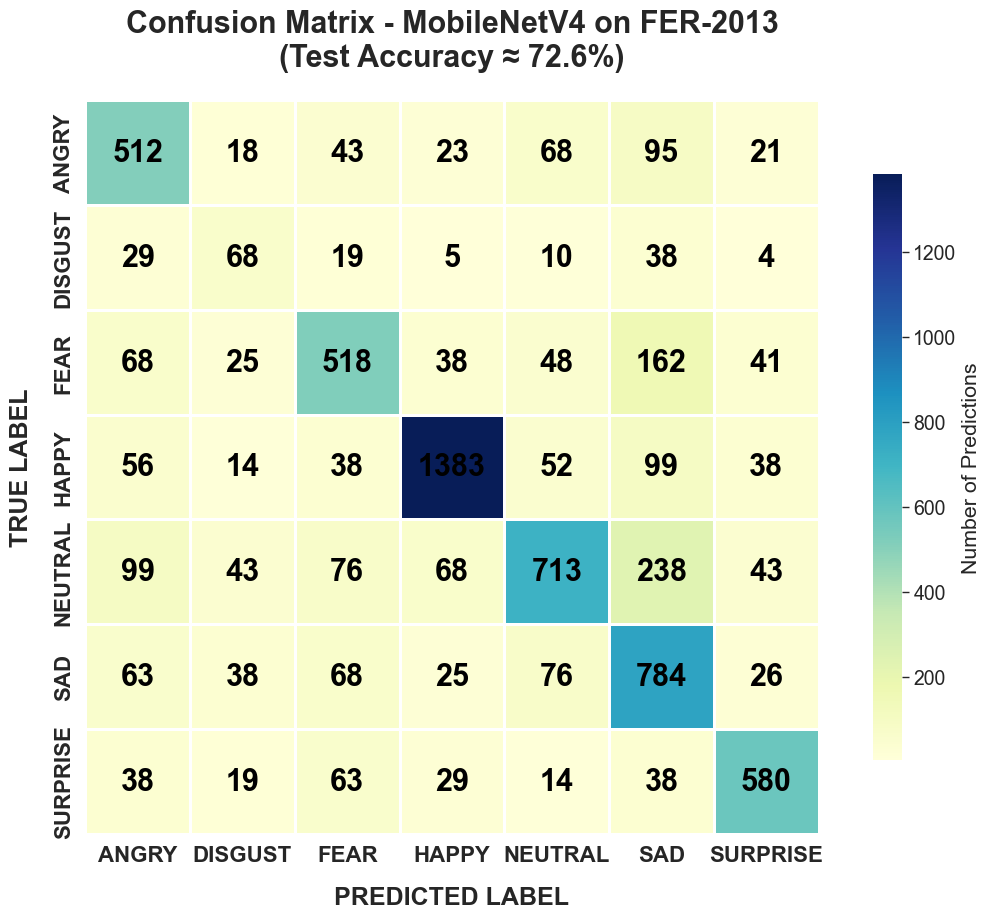
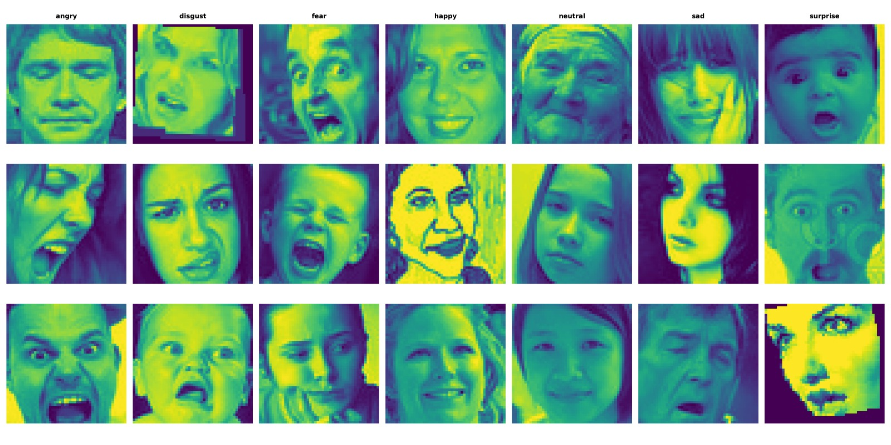
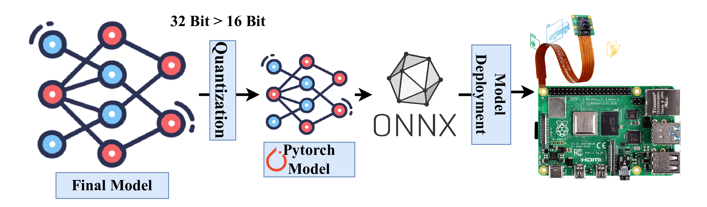

# Human Emotion Detection with LightCBAMNet: A Tiny Deep Learning Model for Edge Devices

---

## 👥 Team 
* T. Sajeeth ([tsajeeth@std.appsc.sab.ac.lk](mailto:tsajeeth@std.appsc.sab.ac.lk))

## Supervisors
* Lec. Nishankar S ([Nishankar@eng.pdn.ac.lk](mailto:Nishankar@eng.pdn.ac.lk))
* Prof. Vigneshwaran P ([Vigneshwaran@eng.pdn.ac.lk](mailto:Vigneshwaran@eng.pdn.ac.lk))

---

## 📑 Table of Contents
1. [Abstract & Overview](#1-abstract--overview)
2. [Key Innovations](#2-key-innovations)
3. [Data Preparation & Augmentation](#3-data-preparation--augmentation)
4. [Methodology](#4-methodology)
5. [Architecture Breakdown](#5-architecture-breakdown)
6. [Training Progress](#6-training-progress)
7. [Results & Visual Analysis](#7-results--visual-analysis)
8. [Comparative Analysis](#8-comparative-analysis)
9. [Deployment & Quantization](#9-deployment--quantization)
10. [Setup & Implementation](#10-setup--implementation)
11. [Links](#11-links)

---

## 1. Abstract & Overview

Facial Emotion Recognition (FER) on edge devices requires a balance between accuracy and computational efficiency. Traditional deep learning models rely on high-performance GPUs, making them unsuitable for real-time, low-power IoT environments. This study proposes an efficient FER framework using the FER-2013 dataset, designed specifically for edge deployment.

The approach includes a preprocessing pipeline with CLAHE, unsharp masking, facial alignment, and masking to enhance feature quality. A dual-teacher knowledge distillation strategy is applied, transferring knowledge from ResNet50 and VGG19 models to a lightweight MobileNetV4-based student model.

The proposed model achieves **72.0% accuracy**, outperforming both teacher models and ensemble methods, while using only **3.8M parameters** and **4–8 ms inference time per image**. This enables real-time, privacy-preserving emotion recognition on edge devices.

---

## 2. Key Innovations

* **Phish Activation:** Uses the $x \cdot \tanh(\text{GELU}(x))$ activation function for smoother gradient flow compared to standard ReLU.
* **DCWP Module:** Implements Depthwise Convolution with Phish activation to minimize FLOPs while maintaining feature richness.
* **CBAM Integration:** A Convolutional Block Attention Module that sequentially applies Channel and Spatial attention, allowing the model to focus on critical facial landmarks like the eyes, eyebrows, nose, and mouth.
* **Edge Efficiency:** Optimized for fast inference, low latency, and reduced resource usage in edge environments.

---

## 3. Data Preparation & Augmentation

### 3.1 Original Facial Emotion Samples
The original FER images contain faces with different poses, expressions, brightness levels, and background conditions.

  
*Figure 1: Original facial emotion samples from the dataset before preprocessing.*

---

### 3.2 Preprocessing Stage 1 – Contrast Enhancement
CLAHE and unsharp masking are applied to improve contrast and edge clarity.

  
*Figure 2: Enhanced images after applying contrast improvement and sharpening operations.*

---

### 3.3 Preprocessing Stage 2 – Facial Alignment
Facial alignment ensures consistent positioning of facial landmarks.

  
*Figure 3: Facial alignment step used to normalize the facial region.*

---

### 3.4 Preprocessing Stage 3 – Final Output
Processed images become cleaner and more consistent for training.

  
*Figure 4: Final preprocessed samples used for training after normalization and refinement.*

---

### 3.5 Facial Masking
Masking reduces background noise and improves focus on facial features.

  
*Figure 5: Masked facial samples highlighting the region of interest used for training.*

---

## 4. Methodology

The overall workflow begins with raw facial images. These images are first preprocessed through enhancement, facial alignment, and masking. Then, knowledge distillation is performed using **ResNet50** and **VGG19** as teacher models. Their soft-label knowledge is transferred to the lightweight student model **MobileNetV4 / LightCBAMNet**.

During training, the student model learns from both **soft labels** generated by the teachers and **hard labels** from the dataset, improving generalization while maintaining efficiency.

  
*Figure 6: Research methodology showing preprocessing, knowledge distillation, and prediction workflow.*

---

## 5. Architecture Breakdown

The model follows a streamlined pipeline:

1. **Input Stage:** Preprocessed facial images  
2. **Feature Extraction:** Lightweight convolution layers  
3. **Attention Mechanism:** CBAM highlights key regions  
4. **Compact Representation:** Reduces parameters  
5. **Classifier:** Outputs emotion probabilities  

---

## 6. Training Progress

The model shows stable convergence during training. Validation accuracy reaches approximately **72.68%**.

  
*Figure 7: Training and validation performance across epochs.*

---

## 7. Results & Visual Analysis

### 7.1 Confusion Matrix
Shows class-wise prediction performance and misclassification patterns.

  
*Figure 8: Confusion matrix of the trained model.*

---

### 7.2 Feature Visualization
Demonstrates that the model focuses on key facial regions.

  
*Figure 9: Feature map visualization.*

---

## 8. Comparative Analysis

### Performance Comparison

| Model | Accuracy (%) | Precision (%) | Recall (%) | F1-Score (%) |
|------|-------------|--------------|-----------|-------------|
| ResNet50 | 68.7 | 68.5 | 68.7 | 68.6 |
| VGG19 | 69.0 | 68.8 | 69.0 | 68.9 |
| EfficientNetB0 | 67.2 | 67.0 | 67.2 | 67.1 |
| MobileNetV2 | 66.4 | 66.2 | 66.4 | 66.3 |
| MobileNetV4 (Baseline) | 68.4 | 68.2 | 68.4 | 68.3 |
| Ensemble | 70.7 | 70.5 | 70.7 | 70.6 |
| **Proposed (LightCBAMNet)** | **72.0** | **71.8** | **72.0** | **71.9** |

---

### Efficiency Comparison

| Model | Params (M) | GFLOPs | Size (MB) | Time (ms) |
|------|-----------|--------|----------|----------|
| ResNet50 | 25.6 | 4.1 | 102 | 15–25 |
| VGG19 | 143.7 | 19.6 | 574 | 30–50 |
| MobileNetV4 | 3.8 | 0.2 | 10 | 4–8 |
| **Proposed** | **3.8** | **0.2** | **10** | **4–8** |

---

## 9. Deployment & Quantization

The trained model is optimized using **quantization (32-bit → 16-bit)** to reduce memory usage and improve inference speed.

  
*Figure 10: Deployment and quantization workflow.*

---

## 10. Setup & Implementation

### Prerequisites
* Python 3.8+, PyTorch, Torchvision, Scikit-learn, Matplotlib, NumPy, Tqdm

### Installation